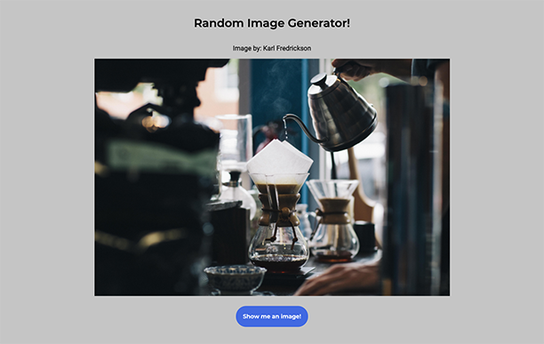

<h1 align="center">Random Image Generator</h1>

# Usage

This is a random image generator. It was a refresher on how to retreive data from an API.
The data is grabbed from Lorem Picsum API.

 
 

# Credits

Skillcrush
